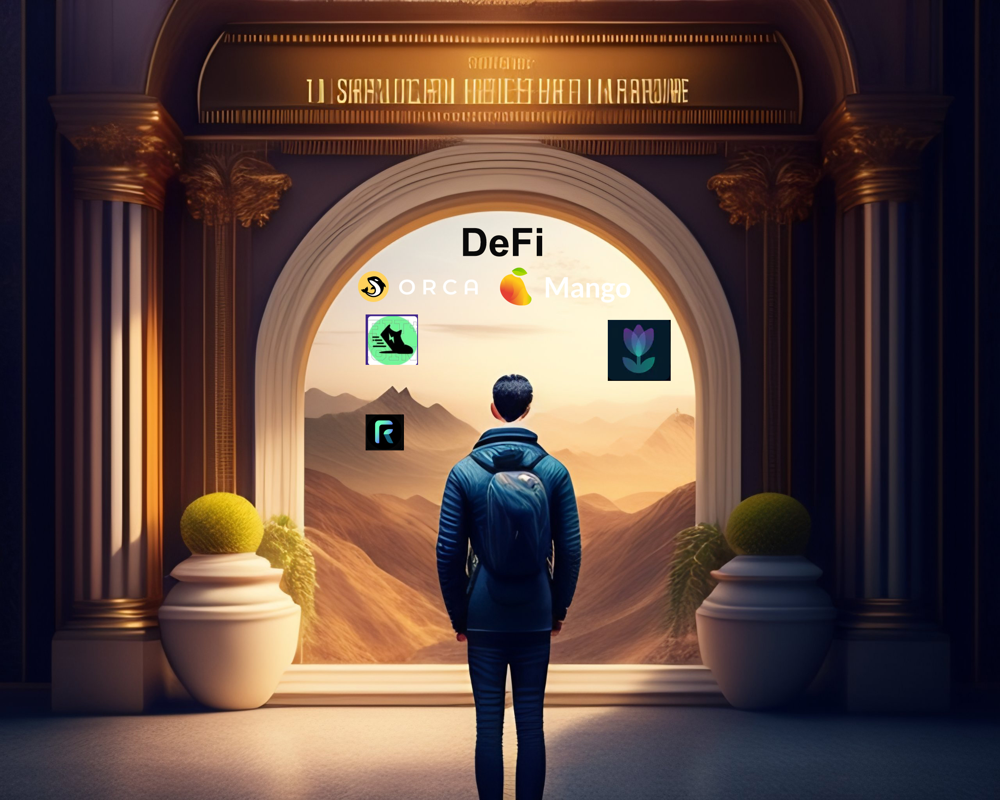

# DEFI HUB DAO

  

## summary

DeFi, finance built for the internet age. DeFi can do everything what traditional finance does today even more faster,cheaper and in an efficient way. And, it's better when awareness cum knowledge of utilising the power of  DeFi technology is spreaded acrossss <s>millions</s> billions of people round the globe.

 Our vision is to create a decentralized autonomous organization (DAO) in the DeFi space that acts as a bridge between users and the  world of DeFi. Our DAO aims to assist users in navigating the DeFi landscape, making it more accessible and user-friendly. Despite the growing popularity of DeFi, people are still struggling in getting grasp of it's existence and the benefits it offers. Moreover, for those who wish to do ventures in DeFi, the steep learning curve is making it difficult to get started. Another major issue faced by DeFi users is the lack of understanding about the potential risks involved especially for those providing liquidity to decentralized exchanges (DEXs). There comes our DAO to rescue, it will help in educating users on these potential risks and provide resources to mitigate them, making it easier for anyone to get involved in DeFi with confidence than ever before!

